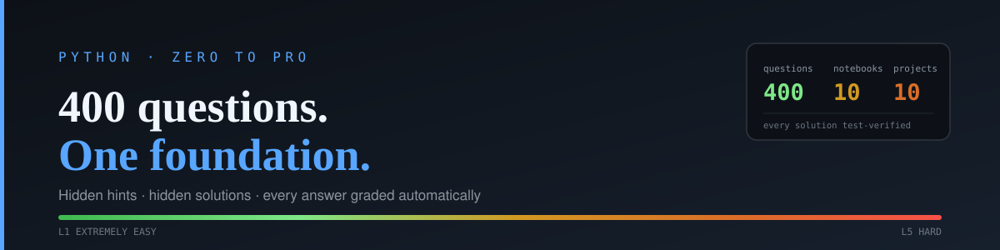

<p align="center">
  
</p>

<p align="center">
  <strong>400 Python practice questions · 10 Jupyter notebooks · 10 mini-projects</strong><br>
  Every question labelled by difficulty, with a hidden hint, a hidden solution, and an automatic checker.
</p>

---

## What this is

A practice course for making your Python foundation airtight. Not a tutorial — you
already know roughly what a loop is. This is 400 problems that make you *fluent*,
arranged so each notebook ramps from trivial to genuinely hard.

Core Python only. No numpy, no pandas, no frameworks. The standard library is the
whole surface, because that is the layer everything else is built on.

**What makes it different from a list of exercises:**

- **Every answer is graded automatically.** `check()` runs your function against real
  test cases and shows you the exact input that broke it — you debug from evidence,
  not from vibes.
- **Hints and solutions are hidden separately**, so you can take a nudge without
  burning the answer.
- **68 questions enforce *how* you solve them.** "Do it without a loop" is checked
  against your code's syntax tree, not left to the honour system.
- **58 questions are "what does this print?" traps** — mutable default arguments,
  late-binding closures, `0.1 + 0.2`, iterator exhaustion. The things that quietly
  break self-taught Python.
- **Every one of the 400 reference solutions is executed against its own test cases
  in CI.** If a solution were wrong, the build would fail.

---

## Quick start

You need **Python 3.10+** and Jupyter. Nothing else.

```bash
git clone https://github.com/Parzevall/python-zero-to-pro-practice.git
cd python-zero-to-pro-practice

python -m venv .venv
source .venv/bin/activate          # Windows: .venv\Scripts\activate
pip install jupyterlab

jupyter lab notebooks/
```

Open `01_foundations_and_operators.ipynb`, **run the first cell**, and start solving.

That is genuinely all. The notebooks use the standard `python3` kernel that every
Jupyter install ships with, and the first cell finds the project automatically
whether you launched Jupyter from the repo root or from inside `notebooks/`.

<details>
<summary><strong>Prefer VS Code, or a different setup?</strong></summary>

<br>

**VS Code** — install the Python and Jupyter extensions, open the folder, open any
notebook, and pick your interpreter when prompted. The `<details>` hint/solution
blocks render natively.

**uv** (faster) —
```bash
uv venv && uv pip install jupyterlab && uv run jupyter lab notebooks/
```

**conda** —
```bash
conda create -n pysprints python=3.12 jupyterlab -y
conda activate pysprints && jupyter lab notebooks/
```

**Optional editable install.** Not required — the first cell handles the import path
on its own — but if you want `import sprintcheck` to work from anywhere:
```bash
pip install -e .
```

**Running tests** (only needed if you are editing the questions themselves):
```bash
pip install pytest && python -m pytest -q
```
</details>

---

## How a question works

Each question is two cells. A markdown cell holds the prompt and two collapsed
toggles; a code cell is where you answer.

> ### Q-047 · L3 Intermediate · Comprehensions
>
> Flatten `grid` (a list of lists) into one flat list using a single comprehension.
> No `for` statement, no `sum()`, no `itertools`.
>
> <details><summary>💡 Hint</summary><br>A nested comprehension's clauses read left-to-right, in the same order you would write the nested for-loops.</details>
>
> <details><summary>✅ Solution</summary><br>Revealed only when you click.</details>

```python
def flatten(grid):
    ...            # your code here

check('Q-047', flatten)
```

Run it, and you get one of these:

```
PASSED  Q-047  (6/6 cases, 0.4ms)
```

```
FAILED  Q-047  3/6 cases passed
  flatten([[1], [], [2]])
    expected  [1, 2]
    got       [1, None, 2]
```

That second output is the point. You are told the exact input that broke, what was
expected, and what you produced — which is how debugging actually works.

### Three commands

| | |
|---|---|
| `check('Q-047', flatten)` | Grade your answer |
| `progress()` | Per-notebook dashboard of what you have solved |
| `reset('Q-047')` | Forget an attempt |

Progress is saved to `.sprintcheck_progress.json`, survives restarts, and is safe to
delete. It is git-ignored, so your progress stays yours.

---

## Difficulty labels

Questions run easiest to hardest down each notebook, and **every notebook ends on L5** —
so you are always stretched before you move on.

| Label | What it means |
|---|---|
| **L1** Extremely Easy | One concept, one line. Builds recall. |
| **L2** Easy | One concept applied, with a small edge case to notice. |
| **L3** Intermediate | Two or three concepts combined, or a non-obvious edge case. |
| **L4** Somewhat Difficult | A design choice to make; correctness needs care. |
| **L5** Hard | Multi-concept, subtle failure modes, or a real semantic trap. |

Across all 400: **70 · 100 · 110 · 80 · 40** from L1 to L5.

---

## The notebooks

| # | Notebook | Qs | What it covers |
|---|---|---|---|
| 01 | Foundations & Operators | 36 | Types, dynamic typing, casting, and all five operator families |
| 02 | Strings | 38 | Indexing, slicing, f-strings, the methods worth knowing cold |
| 03 | Lists & Tuples | 38 | Mutability, aliasing vs copying, unpacking, nesting |
| 04 | Dicts & Sets | 38 | Dict methods, set algebra, hashability, ordering guarantees |
| 05 | Control Flow & Loops | 36 | Includes 6 questions on `else`-on-loop — almost nobody knows it |
| 06 | Functions, Scope & Closures | 42 | Arguments, defaults, `*args`, LEGB, closures, lambda |
| 07 | Comprehensions, Functional & Recursion | 42 | Includes **12 recursion questions**, trivial through Tower of Hanoi |
| 08 | OOP | 44 | Dunder methods, properties, inheritance, composition |
| 09 | Iterators, Generators, Decorators, Context Managers & Exceptions | 44 | The hard middle of the language |
| 10 | Stdlib, Regex, Typing, Concurrency, Testing & Debugging | 42 | The practical layer you use every day |

Each notebook ends with a **mini-project** (30–60 min) that forces you to combine its
topics: a receipt calculator, a word-frequency report, matrix utilities, an inventory
manager, a game engine, a validator toolkit, a records pipeline, a bank-account
hierarchy, a retry + LRU-cache decorator pair, and a log parser.

---

## How to actually use this

Two rules matter more than pace.

**1. Open the hint before the solution, and only after a real attempt.**
A solution you read is worth close to nothing. A solution you reached after a nudge
sticks. If you open the answer without trying, you have read a tutorial, not practised.

**2. When `check()` fails, read the failing case before you change anything.**
The output names the exact input that broke. Forming a hypothesis from evidence is the
skill being trained — guessing and re-running is not.

**On pace:** one notebook a day is aggressive but achievable. Finishing slowly beats
skimming quickly. The gotcha questions in particular are worth sitting with — being
wrong about `0.1 + 0.2` in a notebook is free; being wrong about it in production is not.

---

## For contributors

Notebooks are **generated**, not hand-edited. `content/` is the single source of truth:
each question is one object holding its prompt, hint, solution, explanation and test
cases together, so the answer and the tests can never drift apart.

```bash
python build.py                 # generate any missing notebooks
python build.py --check         # report drift, write nothing
python build.py --force         # regenerate (WARNING: discards written answers)
python -m pytest -q             # verify all 400 solutions pass their own cases
```

`build.py` refuses to overwrite a notebook that already exists unless you pass
`--force`, so your answers are safe from an accidental rebuild.

```
content/       question source of truth  (edit here)
sprintcheck/   the grader
build.py       content/ -> notebooks/
notebooks/     generated — what you open
tests/         proves every solution is correct
```

The test suite asserts more than correctness: question IDs stay contiguous, the
difficulty distribution holds exactly, no question repeats a test case, and no starter
shadows the grader's own function names.

---

<p align="center"><sub>Built for deliberate practice. Solutions verified by 467 automated tests.</sub></p>
