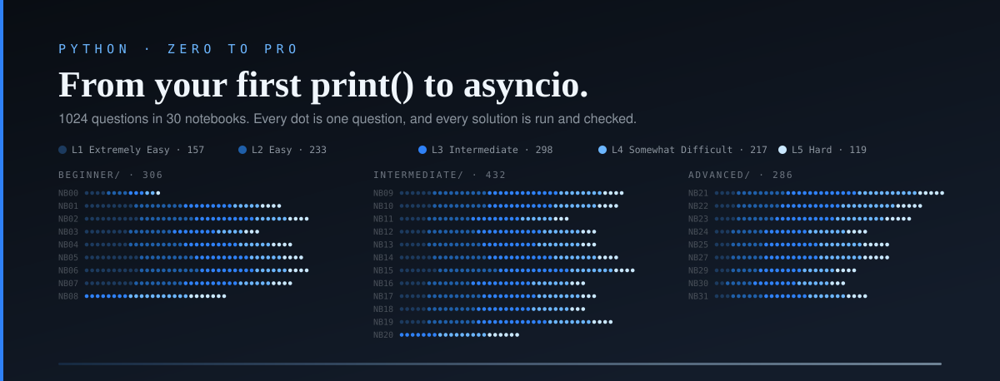

<p align="center">
  
</p>

<p align="center">
  <strong>1,024 Python practice questions · 30 notebooks · beginner → intermediate → advanced</strong><br>
  Every question is ranked L1 to L5 and comes with a hint, the expected output, a solution, and how a senior developer would write it.
</p>

---

## What this is

A practice course for making your Python solid, from your very first `print()` to
asyncio, descriptors and real-world programs. It isn't a tutorial: each notebook
is a set of questions that make you *use* the ideas until they stick.

**Nothing is used before it's taught.** Every notebook opens with a
**Prerequisites** list, and every beginner-friendly solution sticks to what that
notebook and the ones before it cover. A notebook-1 question never needs a loop.

**Four dropdowns on every question:**

| Dropdown | What's inside |
|---|---|
| **Hint** | A nudge in the right direction, never the answer |
| **Expected output** | Exactly what your code should print, so you can check yourself |
| **Solution** | A clean answer using only what you've learned so far, with an explanation |
| **Senior dev solution** | How an experienced developer would write it, and *why* |

**Five kinds of question**, because writing code is only half the skill:

| Type | What you do |
|---|---|
| **Write** | Write code that prints the answer |
| **Predict** | Read code and predict exactly what it prints |
| **Error** | Predict which error the code raises |
| **Fix** | Find and fix the bug |
| **Refactor** | Make working code cleaner without changing what it prints |

---

## Getting started

You need Python 3.12 or newer, and Jupyter.

```bash
git clone https://github.com/Parzevall/python-zero-to-pro-practice.git
cd python-zero-to-pro-practice

python -m venv .venv
source .venv/bin/activate          # Windows: .venv\Scripts\activate
pip install jupyterlab

jupyter lab
```

Open `beginner/NB00-Start-Here.ipynb` and work down from there. There's no setup
cell and nothing to import: each question is plain text plus an empty cell for
your code.

<details>
<summary><strong>Using VS Code, uv, or conda instead?</strong></summary>

<br>

**VS Code.** Install the Python and Jupyter extensions, open the folder, open any
notebook, and pick your interpreter when it asks. The dropdowns render natively.

**uv:**
```bash
uv venv && uv pip install jupyterlab && uv run jupyter lab
```

**conda:**
```bash
conda create -n zero-to-pro python=3.13 jupyterlab -y
conda activate zero-to-pro && jupyter lab
```
</details>

---

## How to use it

1. Read the question and write your code in the cell beneath it.
2. Run the cell, then open **Expected output** and compare.
3. Stuck? Open **Hint** first. Open **Solution** only after a real attempt.
4. Once yours works, open **Senior dev solution**. This is where most of the
   learning happens: naming, edge cases, the right tool for the job.

Questions run from **L1 Extremely Easy** to **L5 Hard** inside every notebook, and
every notebook ends with a **mini-project** that pulls it all together.

| Level | Meaning |
|---|---|
| **L1** | One idea, a line or two |
| **L2** | One idea with a small twist |
| **L3** | Two or three ideas combined |
| **L4** | Needs care to get exactly right |
| **L5** | Several ideas and a trap or two |

A solution you read is worth close to nothing; one you reached after a nudge
sticks. Finishing slowly beats skimming quickly.

---

## The notebooks

### `beginner/`: no Python needed

| # | Notebook | Questions | What you practise |
|---|---|---|---|
| NB00 | [Start Here](beginner/NB00-Start-Here.ipynb) | 14 | Running cells; print(); Comments |
| NB01 | [Variables Types Operators](beginner/NB01-Variables-Types-Operators.ipynb) | 36 | Variables; Assignment; int |
| NB02 | [Strings](beginner/NB02-Strings.ipynb) | 41 | Quotes; len(); Immutability |
| NB03 | [Conditionals](beginner/NB03-Conditionals.ipynb) | 32 | if / elif / else and indentation; Combining conditions with and/or/not; Truthiness in conditions (if name |
| NB04 | [Loops](beginner/NB04-Loops.ipynb) | 38 | for over a string; Accumulator patterns; while loops |
| NB05 | [Lists Tuples](beginner/NB05-Lists-Tuples.ipynb) | 40 | Creating lists; Changing a list; sort() vs sorted() |
| NB06 | [Dicts Sets](beginner/NB06-Dicts-Sets.ipynb) | 41 | Creating dicts; access with [] vs get(); KeyError; Add; Looping over keys |
| NB07 | [Functions Basics](beginner/NB07-Functions-Basics.ipynb) | 38 | def; return vs print; functions return None by default; Returning several values (a tuple) |
| NB08 | [Beginner Capstone](beginner/NB08-Beginner-Capstone.ipynb) | 26 | Mixed problems where you decide which tools to use; Reading a problem; Classic exercises that test your fundamentals |

### `intermediate/`: writing real programs

| # | Notebook | Questions | What you practise |
|---|---|---|---|
| NB09 | [Functions Advanced](intermediate/NB09-Functions-Advanced.ipynb) | 41 | *args and **kwargs; unpacking arguments in calls with * and **; Keyword-only (*) and positional-only (/) parameters; parameter order rules; lambda |
| NB10 | [Comprehensions Functional Sorting](intermediate/NB10-Comprehensions-Functional-Sorting.ipynb) | 40 | List comprehensions; Nested comprehensions (flatten; Dict and set comprehensions |
| NB11 | [Recursion](intermediate/NB11-Recursion.ipynb) | 31 | Base case and recursive case; the call stack; Recursion vs iteration; Recursion on strings |
| NB12 | [Exceptions](intermediate/NB12-Exceptions.ipynb) | 36 | The built-in exception hierarchy (LookupError above KeyError and IndexError); try / except / else / finally; several except clauses; as e; raise |
| NB13 | [Modules Files JSON CSV](intermediate/NB13-Modules-Files-JSON-CSV.ipynb) | 36 | import styles; Writing your own module; if __name__ == '__main__'; packages and __init__.py; pathlib |
| NB14 | [OOP Basics](intermediate/NB14-OOP-Basics.ipynb) | 40 | class and instance; __init__ and self; Instance attributes vs class attributes; Methods; __str__ and __repr__ |
| NB15 | [Stdlib Essentials](intermediate/NB15-Stdlib-Essentials.ipynb) | 43 | collections; itertools; datetime |
| NB16 | [Numbers Bits Bytes Unicode](intermediate/NB16-Numbers-Bits-Bytes-Unicode.ipynb) | 34 | Integers of any size; floats as IEEE 754; math.isclose; inf and nan; Decimal for money; Number bases |
| NB17 | [Regex](intermediate/NB17-Regex.ipynb) | 36 | re.search; Character classes; Groups |
| NB18 | [Pythonic Idioms Pattern Matching](intermediate/NB18-Pythonic-Idioms-Pattern-Matching.ipynb) | 34 | Names vs objects in depth; Extended unpacking (first; The walrus operator  |
| NB19 | [Data Structures Algorithms](intermediate/NB19-Data-Structures-Algorithms.ipynb) | 39 | Big-O intuition for list; Stack (list); A linked list class |
| NB20 | [Intermediate Capstone](intermediate/NB20-Intermediate-Capstone.ipynb) | 22 | Multi-part problems that use OOP |

### `advanced/`: how Python works, and how seniors use it

| # | Notebook | Questions | What you practise |
|---|---|---|---|
| NB21 | [OOP Advanced](advanced/NB21-OOP-Advanced.ipynb) | 42 | __repr__; The __eq__ and __hash__ contract; ordering with total_ordering; Operator overloading |
| NB22 | [Iterators Generators](advanced/NB22-Iterators-Generators.ipynb) | 38 | Iterable vs iterator; iter() and next(); StopIteration; Writing an iterator class; Generator functions |
| NB23 | [Decorators](advanced/NB23-Decorators.ipynb) | 36 | How @ works; writing a decorator; functools.wraps; Decorators that take arguments (factories); stacking order |
| NB24 | [Context Managers](advanced/NB24-Context-Managers.ipynb) | 28 | The with protocol; Exception info and suppression (returning True); contextlib.contextmanager |
| NB25 | [Descriptors Metaprogramming](advanced/NB25-Descriptors-Metaprogramming.ipynb) | 32 | Attribute lookup order; __getattr__ vs __getattribute__; __setattr__; Descriptors; How property |
| NB26 | Type Hints *(coming soon)* | – | Annotating variables; Built-in generics (list[int]); X | None; Callable; collections.abc types; Generics |
| NB27 | [Concurrency Asyncio](advanced/NB27-Concurrency-Asyncio.ipynb) | 32 | Concurrency vs parallelism; the GIL and the free-threaded build (3.13+); threading.Thread; concurrent.futures |
| NB28 | Testing Debugging Logging *(coming soon)* | – | assert-based tests; arrange-act-assert; choosing edge cases; unittest; pytest style |
| NB29 | [Performance Memory](advanced/NB29-Performance-Memory.ipynb) | 26 | Measuring with timeit; Costs of built-in operations; choosing the right container; join vs += for strings; generators to save memory |
| NB30 | [Networking HTTP APIs](advanced/NB30-Networking-HTTP-APIs.ipynb) | 24 | How HTTP works; Sockets; http.server |
| NB31 | [Real World Programs](advanced/NB31-Real-World-Programs.ipynb) | 28 | Project layout; argparse (called with an explicit argument list); Config from os.environ and tomllib (3.11+) |
| NB32 | Advanced Capstone *(coming soon)* | – | System-design-sized problems that bring the advanced topics together |

---

## How the answers are checked

`tools/verify.py` reads every notebook and, for every question:

- runs the **Solution** and checks it prints exactly the **Expected output**,
- runs the **Senior dev solution** and checks it prints the same thing,
- checks Predict, Error, Fix and Refactor code behaves the way the question says,
- runs everything twice with different hash seeds, so output that could change
  between runs (set order, randomness, the clock) is caught,
- checks every Solution only uses what its notebook's prerequisites cover.

```bash
python tools/verify.py                         # every notebook
python tools/verify.py beginner/NB01-*.ipynb   # just one
```

It needs only the standard library, and it never looks at your own answers. If
you edit a notebook, run it to make sure nothing broke. Clear cell outputs before
committing.

```
beginner/  intermediate/  advanced/   the notebooks
tools/verify.py                       checks every question
tools/make_header.py                  regenerates assets/header.svg from the notebooks
tests/                                tests for the checker itself (python -m pytest -q)
```

---

<p align="center"><sub>Built for deliberate practice. Every solution is run and checked.</sub></p>
